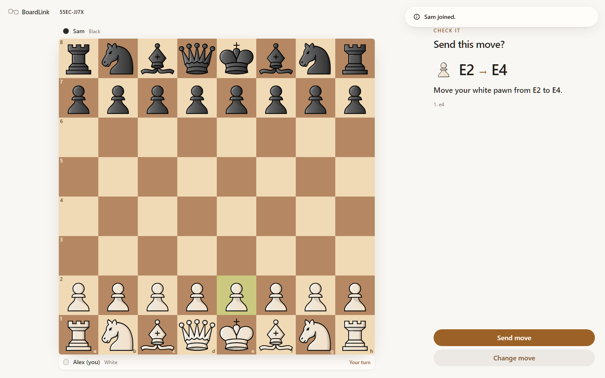
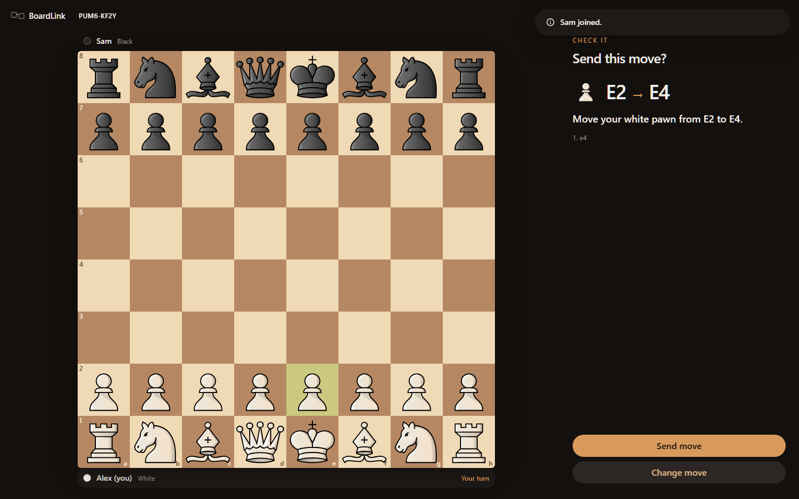
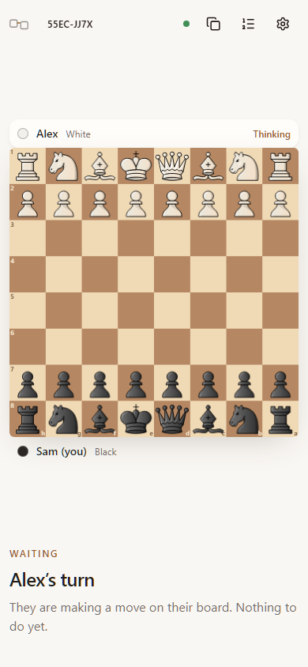
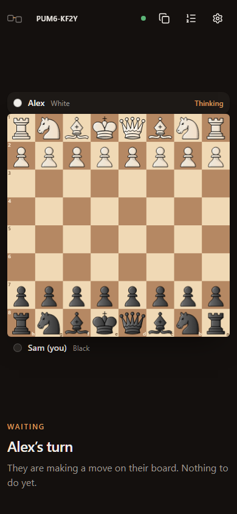

# BoardLink

Play chess with someone far away, on the wooden board already sitting in front
of you.

BoardLink is not an online chess site. There is no digital board to play on, no
rating, no engine and no account. Each player keeps a real chessboard, and
BoardLink carries the moves between them:

1. You move a piece on your real board.
2. You enter that move into BoardLink.
3. Your friend sees **“Move the black pawn from E7 to E5.”**
4. They copy it onto their real board and press **Done — I moved it**.
5. Now it is their turn.

The physical board is the product. The website is the messenger.

|  |  |
| --- | --- |
|  |  |
| Desktop, light | Desktop, dark |
|  |  |
| Mobile, light | Mobile, dark |

---

## Quick start

```bash
npm install
cp .dev.vars.example .dev.vars
npm run dev
```

Open http://localhost:5173, press **Start a game**, and open the invite link in a
second browser profile (a different profile, not a second tab — a device holds
one seat per game).

The dev server runs the real Cloudflare Worker and Durable Object through the
Cloudflare Vite plugin, so local behaviour matches production.

## Scripts

| Command | What it does |
| --- | --- |
| `npm run dev` | Vite dev server with the Worker and Durable Objects running |
| `npm run build` | Typechecks all three projects, then builds client + worker |
| `npm run typecheck` | `tsc -b` across app, node and worker configs |
| `npm test` | Unit tests (Vitest) |
| `npm run test:e2e` | Two-browser, theme and accessibility tests (Playwright) |
| `npm run test:all` | Typecheck, unit tests and end-to-end tests |
| `npm run deploy` | Build and deploy to Cloudflare |
| `npm run assets:lichess` | Re-extract the Lichess board and piece artwork |
| `npm run heroui-docs` | Refresh the local HeroUI v3 docs in `.heroui-docs/` |

Before the first end-to-end run:

```bash
npx playwright install chromium firefox webkit
```

The suite runs the two-player specs on Chromium and repeats the accessibility
and theme specs on Chromium, Firefox and WebKit.

Regenerate the screenshots above with:

```bash
npx playwright test --project=screenshots
```

## Interface

Built with **HeroUI v3** and **Tailwind CSS v4**.

- **Light, dark and system themes.** One controller — HeroUI's `useTheme` —
  plus an inline script in `index.html` that applies the stored theme before the
  first paint, so there is no flash.
- **A warm, tactile palette** defined in `src/styles/theme.css`. It overrides
  HeroUI's built-in `light` and `dark` themes rather than adding new theme
  names, which is what keeps system mode working with no extra wiring. The
  interface is pulled toward amber so it reads as the table the board sits on,
  rather than a grey dashboard the board was pasted onto.
- **A near-full-screen board.** `BoardFrame` measures the space actually left
  over and sizes the board to the largest square that fits, pinning the player
  strips to exactly that width.

### The board

The board is a purpose-built component (`src/components/board/`), not a
charting library:

- The exact Lichess **Brown** board and **Maestro** pieces, vendored into
  `public/vendor/lichess/` — see [THIRD_PARTY_NOTICES.md](THIRD_PARTY_NOTICES.md).
- Tap-to-move, drag-and-drop, and full keyboard play. Every square is a real
  `<button>` with a description like *“E4, white pawn, part of the last move”*,
  and arrow keys move between squares via a roving tabindex.
- Pieces are positioned with CSS transforms so movement runs on the compositor.

## Documentation

| File | Contents |
| --- | --- |
| [ARCHITECTURE.md](ARCHITECTURE.md) | How the pieces fit together, and why |
| [PROTOCOL.md](PROTOCOL.md) | The WebSocket contract and the room state machine |
| [SECURITY.md](SECURITY.md) | Anonymous rooms, seat tokens, rate limits, retention |
| [ACCESSIBILITY.md](ACCESSIBILITY.md) | WCAG 2.2 AA commitments and how they are tested |
| [THIRD_PARTY_NOTICES.md](THIRD_PARTY_NOTICES.md) | Lichess artwork licensing — **read before shipping commercially** |

## Folder structure

```
shared/      Types and logic used by both the browser and the Worker
  protocol.ts       Wire contract: events, room snapshot, limits
  chessEngine.ts    chess.js adapter: validation, serialisation, PGN
  moveLanguage.ts   Plain-language move instructions
  roomCode.ts       Human-readable room codes

worker/      Cloudflare Worker and Durable Objects
  index.ts          HTTP routing, origin checks, rate limiting
  GameRoom.ts       One Durable Object per game; the authority on the position
  roomLogic.ts      The room state machine, as pure testable functions
  RateLimiter.ts    Per-IP fixed-window counter
  crypto.ts         Secret generation, hashing, constant-time comparison

src/         React client
  components/board/ The board: geometry, rendering, input, sizing
  components/game/  Top bar, player strips, turn panel, settings, overlays
  routes/           Landing, Join, Room, HowItWorks, NotFound
  hooks/            Room socket, settings, asset preloading, media queries
  lib/              API client, snapshot reducer, view derivation, copy
  styles/           Tailwind + HeroUI cascade and the BoardLink theme

tests/       Unit tests (Vitest)
e2e/         Two-browser, theme, accessibility and screenshot specs
scripts/     Asset extraction
```

## Deploying to Cloudflare

```bash
npx wrangler login
npm run deploy
```

The first deploy creates the `GameRoom` and `RateLimiter` Durable Object classes
from the `v1` migration in `wrangler.jsonc`.

After deploying, set the production origin so a page on another domain cannot
open sockets into your rooms:

```bash
npx wrangler secret put ALLOWED_ORIGINS
# e.g. https://boardlink.example.com
```

Do **not** set `RATE_LIMIT_MULTIPLIER` in production — it exists only so local
development and end-to-end runs, which all share one rate-limit bucket, do not
throttle themselves. See `.dev.vars.example`.

## Known limitations

- One device holds one seat per game. Two players on the same browser profile
  will share a seat; use two profiles or two devices.
- There is no chat, by design.
- Clocks are optional and switch on move acceptance, so copying the move onto
  your board happens on your own time.
- The bundled piece set is licensed for non-commercial use only. See
  [THIRD_PARTY_NOTICES.md](THIRD_PARTY_NOTICES.md).
